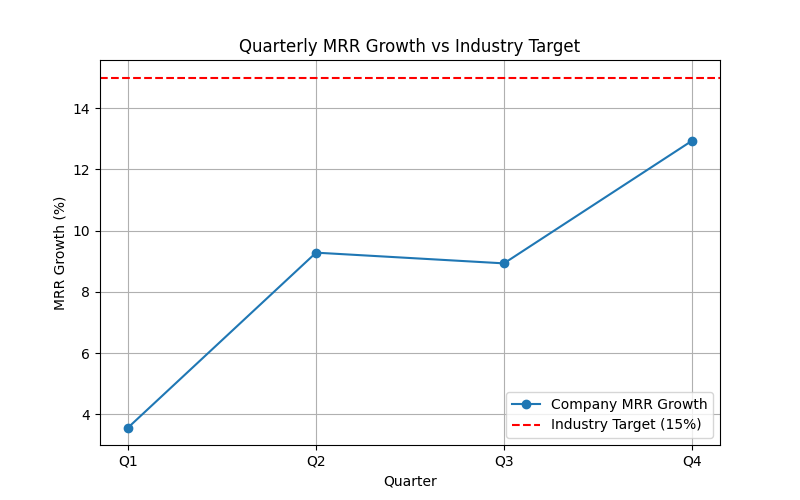
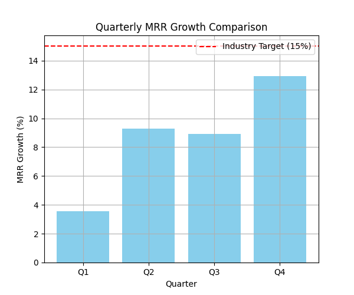

# SaaS Technology Performance Analysis

**Author**: Pooja  
**Email**: 23f1002492@ds.study.iitm.ac.in  

## 📊 Quarterly MRR Growth Data (2024)

| Quarter | MRR Growth (%) |
|---------|----------------|
| Q1      | 3.57           |
| Q2      | 9.28           |
| Q3      | 8.93           |
| Q4      | 12.93          |

**Average MRR Growth**: **8.68%**  
**Industry Target**: **15%**

---

## 🔍 Key Findings

- Q1 underperformed significantly with only **3.57%** growth.
- Q4 showed the highest growth at **12.93%**, nearing the industry benchmark.
- The average growth of **8.68%** is well below the target of **15%**.
- There's a positive trend from Q1 to Q4, but growth is inconsistent.

---

## 💼 Business Implications

- Below-industry performance may lead to reduced investor confidence and hinder future fundraising.
- Current market saturation suggests the company is not tapping into new high-growth customer segments.
- Without change, the company may fall behind competitors meeting or exceeding the 15% benchmark.

---

## ✅ Recommendation: Expand into New Market Segments

**Actionable Steps**:
1. **Segment Analysis**: Identify under-penetrated industries or geographies.
2. **Product Customization**: Tailor SaaS features to match unique needs of new segments.
3. **Partnerships**: Collaborate with industry-specific platforms for quicker market entry.
4. **Marketing Optimization**: Run targeted campaigns for emerging sectors (e.g., fintech, edtech, healthcare SaaS).

---

## 📈 Visuals

### MRR Trend Over Quarters  

### MRR vs Industry Target  

---

**LLM Assistance**: Analysis and code generation powered by ChatGPT Codex.

